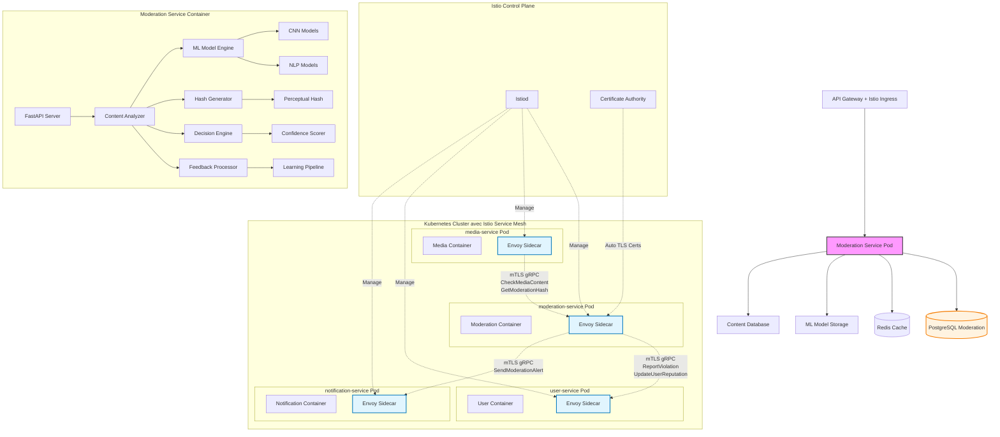
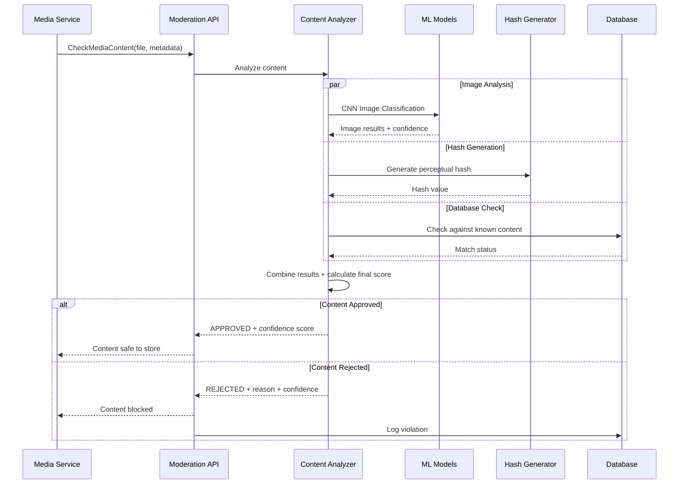
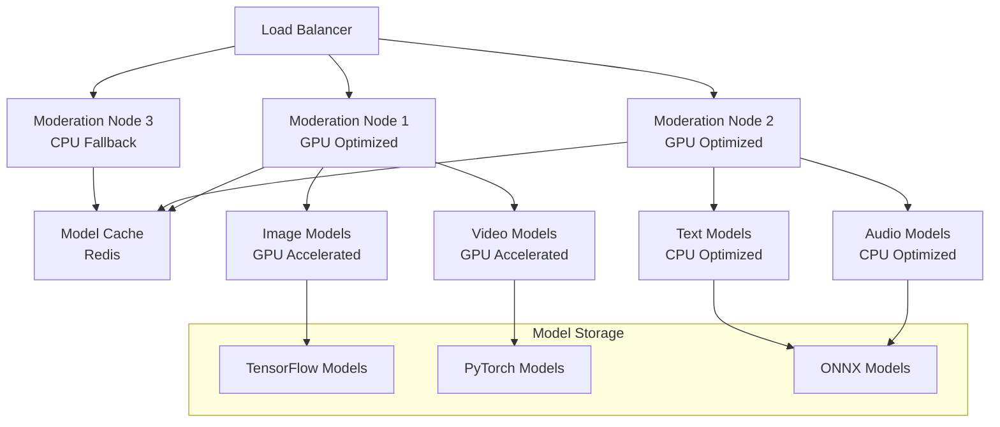

# Moderation Service (`moderation-service`) - System Design Document

## 0. Sommaire

- [1. Introduction](#1-introduction)
  - [1.1 Objectif du Document](#11-objectif-du-document)
  - [1.2 Périmètre du Service](#12-périmètre-du-service)
  - [1.3 Relations avec les Autres Services](#13-relations-avec-les-autres-services)
- [2. Architecture Globale](#2-architecture-globale)
  - [2.1 Vue d'Ensemble de l'Architecture avec Istio Service Mesh](#21-vue-densemble-de-larchitecture-avec-istio-service-mesh)
  - [2.2 Principes Architecturaux](#22-principes-architecturaux)
- [3. Choix Technologiques](#3-choix-technologiques)
  - [3.1 Stack Technique](#31-stack-technique)
  - [3.2 Infrastructure](#32-infrastructure)
- [4. Composants Principaux](#4-composants-principaux)
  - [4.1 Structure FastAPI/Python](#41-structure-fastapipython)
  - [4.2 Moteur de Classification ML](#42-moteur-de-classification-ml)
  - [4.3 Gestionnaire de Hash Perceptuels](#43-gestionnaire-de-hash-perceptuels)
  - [4.4 Système d'Apprentissage Continu](#44-système-dapprentissage-continu)
  - [4.5 Base de Données de Contenus Interdits](#45-base-de-données-de-contenus-interdits)
  - [4.6 Communication avec les autres services via Istio Service Mesh](#46-communication-avec-les-autres-services-via-istio-service-mesh)
    - [4.6.1 Configuration Istio pour moderation-service](#461-configuration-istio-pour-moderation-service)
  - [4.7 Configuration et Modules](#47-configuration-et-modules)
- [5. Types de Modération Gérés](#5-types-de-modération-gérés)
  - [5.1 Modération d'Images](#51-modération-dimages)
  - [5.2 Modération de Vidéos](#52-modération-de-vidéos)
  - [5.3 Modération d'Audio](#53-modération-daudio)
  - [5.4 Modération de Documents](#54-modération-de-documents)
  - [5.5 Détection de Contenu Dupliqué](#55-détection-de-contenu-dupliqué)
- [6. Modèles de Machine Learning](#6-modèles-de-machine-learning)
  - [6.1 Architecture des Modèles](#61-architecture-des-modèles)
  - [6.2 Entraînement et Validation](#62-entraînement-et-validation)
  - [6.3 Déploiement et Versioning](#63-déploiement-et-versioning)
- [7. Scaling et Performances](#7-scaling-et-performances)
  - [7.1 Stratégie de Scaling](#71-stratégie-de-scaling)
  - [7.2 Optimisations et Cache](#72-optimisations-et-cache)
  - [7.3 Limites et Quotas avec Istio](#73-limites-et-quotas-avec-istio)
- [8. Monitoring et Observabilité](#8-monitoring-et-observabilité)
  - [8.1 Observabilité Istio](#81-observabilité-istio)
  - [8.2 Logging](#82-logging)
  - [8.3 Métriques](#83-métriques)
  - [8.4 Alerting](#84-alerting)
- [9. Gestion des Erreurs et Résilience](#9-gestion-des-erreurs-et-résilience)
  - [9.1 Stratégie de Gestion des Erreurs](#91-stratégie-de-gestion-des-erreurs)
  - [9.2 Résilience avec Istio](#92-résilience-avec-istio)
  - [9.3 Plan de Reprise d'Activité](#93-plan-de-reprise-dactivité)
- [10. Évolution et Maintenance](#10-évolution-et-maintenance)
  - [10.1 Versionnement](#101-versionnement)
  - [10.2 Mise à Jour et Déploiement](#102-mise-à-jour-et-déploiement)
  - [10.3 Documentation Technique](#103-documentation-technique)
- [11. Considérations Opérationnelles](#11-considérations-opérationnelles)
  - [11.1 DevOps](#111-devops)
  - [11.2 Environnements](#112-environnements)
  - [11.3 Support](#113-support)
- [Appendices](#appendices)
  - [A. Métriques de Performance Cibles](#a-métriques-de-performance-cibles)
  - [B. Estimation des Ressources](#b-estimation-des-ressources)
  - [C. Configuration Istio Examples](#c-configuration-istio-examples)
  - [D. Références](#d-références)

## 1. Introduction

### 1.1 Objectif du Document
Ce document décrit l'architecture et la conception technique du service de modération (`moderation-service`) de l'application Whispr. Il sert de référence pour l'équipe de développement et les parties prenantes du projet.

### 1.2 Périmètre du Service
Le Moderation Service est responsable de l'analyse automatique de tous les contenus multimédias partagés dans Whispr. Il utilise des modèles de machine learning pour détecter les contenus inappropriés, génère des hash perceptuels pour identifier les doublons, et maintient une base de données de contenus interdits. Le service assure une modération préventive avec une précision cible de ≥85% et un système d'apprentissage continu pour améliorer ses performances.

### 1.3 Relations avec les Autres Services
Le Moderation Service interagit principalement avec le media-service via Istio Service Mesh :
- **media-service** : analyse de tous les médias avant stockage et pendant les uploads
- **user-service** : reporting des violations et gestion des sanctions utilisateur
- **notification-service** : alertes administrateurs sur contenus problématiques
- **scheduling-service** : tâches de maintenance et mise à jour des modèles

## 2. Architecture Globale

### 2.1 Vue d'Ensemble de l'Architecture avec Istio Service Mesh

Le service de modération fonctionne dans un service mesh Istio qui sécurise automatiquement toutes les communications inter-services :



### 2.2 Principes Architecturaux

- **Modération préventive** : Analyse automatique avant acceptation des contenus
- **Zero Trust Network** : Toutes les communications inter-services chiffrées et authentifiées via mTLS
- **Service Mesh Security** : Sécurité implémentée au niveau infrastructure via Istio
- **Apprentissage continu** : Amélioration continue des modèles via feedback utilisateur
- **Haute précision** : Objectif de ≥85% de précision avec minimisation des faux positifs
- **Performance optimisée** : Analyse rapide (< 5 secondes) pour une UX fluide
- **Scalabilité intelligente** : Adaptation automatique de la charge selon le volume de contenu
- **Observabilité** : Monitoring complet des performances des modèles et métriques métier

## 3. Choix Technologiques

### 3.1 Stack Technique

- **Langage** : Python 3.11+
- **Framework** : FastAPI pour les APIs REST
- **Service Mesh** : Istio pour la sécurité et l'observabilité des communications inter-services
- **Proxy Sidecar** : Envoy (injecté automatiquement par Istio)
- **Sécurité Inter-Services** : mTLS automatique via Istio avec rotation de certificats
- **Base de données** : PostgreSQL pour métadonnées et résultats de modération
- **Cache** : Redis pour cache des hash et résultats récents
- **ML Framework** : TensorFlow/Keras pour les modèles de deep learning
- **Computer Vision** : OpenCV et Pillow pour traitement d'images
- **NLP** : spaCy et transformers pour analyse de texte
- **Communication inter-services** : gRPC over mTLS automatique via Istio Service Mesh
- **ORM** : SQLAlchemy avec Alembic pour les migrations
- **API** : REST avec documentation OpenAPI/Swagger automatique
- **Validation** : Pydantic pour la validation des données
- **Async Support** : AsyncIO pour les opérations non-bloquantes
- **Testing** : Pytest pour les tests unitaires et d'intégration

### 3.2 Infrastructure

- **Containerisation** : Docker avec images optimisées pour ML
- **Orchestration** : Kubernetes (GKE) avec support GPU
- **Service Mesh** : Istio avec injection automatique de sidecars Envoy
- **Security** : mTLS automatique, AuthorizationPolicies et NetworkPolicies Istio
- **CI/CD** : GitHub Actions avec pipeline ML spécialisé
- **Service Cloud** : Google Cloud Platform (GCP)
- **GPU Support** : NVIDIA T4 pour accélération des modèles
- **Model Storage** : Google Cloud Storage pour modèles et datasets
- **Monitoring** : Prometheus + Grafana + Kiali (Istio service topology)
- **Logging** : Loki + accès logs Envoy
- **Tracing** : Jaeger (intégré avec Istio pour le tracing distribué)
- **Certificate Management** : Istio CA pour la rotation automatique des certificats mTLS
- **Secrets Management** : Google Secret Manager pour les clés d'API et modèles

## 4. Composants Principaux

### 4.1 Structure FastAPI/Python

L'architecture FastAPI du service est organisée comme suit :

```
src/
├── main.py                          # Point d'entrée FastAPI
├── config/                          # Configuration
│   ├── settings.py                  # Configuration globale
│   ├── database.py                  # Configuration PostgreSQL
│   ├── redis.py                     # Configuration Redis
│   ├── ml_config.py                 # Configuration des modèles ML
│   └── logging.py                   # Configuration logging
├── api/                            # API REST
│   ├── __init__.py
│   ├── v1/                         # Version 1 de l'API
│   │   ├── __init__.py
│   │   ├── endpoints/
│   │   │   ├── moderation.py             # Endpoints de modération
│   │   │   ├── feedback.py               # Endpoints de feedback
│   │   │   ├── admin.py                  # Endpoints administrateurs
│   │   │   ├── metrics.py                # Endpoints de métriques
│   │   │   └── health.py                 # Health checks
│   │   └── deps.py                       # Dépendances API
├── core/                           # Logique métier principale
│   ├── __init__.py
│   ├── moderation/                 # Moteur de modération
│   │   ├── __init__.py
│   │   ├── analyzer.py                   # Analyseur principal
│   │   ├── decision_engine.py            # Moteur de décision
│   │   ├── confidence.py                 # Calcul de confiance
│   │   └── processor.py                  # Processeur de contenu
│   ├── ml/                         # Machine Learning
│   │   ├── __init__.py
│   │   ├── models/
│   │   │   ├── image_classifier.py      # Classificateur d'images
│   │   │   ├── video_analyzer.py         # Analyseur de vidéos
│   │   │   ├── audio_classifier.py      # Classificateur audio
│   │   │   └── text_analyzer.py          # Analyseur de texte
│   │   ├── training/
│   │   │   ├── trainer.py                # Entraînement des modèles
│   │   │   ├── evaluator.py              # Évaluation des modèles
│   │   │   └── pipeline.py               # Pipeline d'entraînement
│   │   └── inference/
│   │       ├── predictor.py              # Prédictions
│   │       ├── batch_processor.py        # Traitement par lots
│   │       └── model_loader.py           # Chargement des modèles
│   ├── hashing/                    # Génération de hash
│   │   ├── __init__.py
│   │   ├── perceptual_hash.py            # Hash perceptuel
│   │   ├── similarity.py                 # Calcul de similarité
│   │   └── deduplication.py              # Déduplication
│   ├── database/                   # Base de contenus interdits
│   │   ├── __init__.py
│   │   ├── content_db.py                 # Base de données de contenu
│   │   ├── hash_db.py                    # Base de données de hash
│   │   └── reputation.py                 # Système de réputation
│   └── feedback/                   # Système de feedback
│       ├── __init__.py
│       ├── collector.py                  # Collecteur de feedback
│       ├── validator.py                  # Validateur de feedback
│       └── learning.py                   # Apprentissage continu
├── models/                         # Modèles de données
│   ├── __init__.py
│   ├── moderation.py                     # Modèle Moderation
│   ├── content.py                        # Modèle Content
│   ├── feedback.py                       # Modèle Feedback
│   └── metrics.py                        # Modèle Metrics
├── schemas/                        # Schémas Pydantic
│   ├── __init__.py
│   ├── moderation.py                     # Schémas Moderation
│   ├── content.py                        # Schémas Content
│   ├── feedback.py                       # Schémas Feedback
│   └── metrics.py                        # Schémas Metrics
├── services/                       # Services externes
│   ├── __init__.py
│   ├── grpc/                       # Clients gRPC
│   │   ├── __init__.py
│   │   ├── media_client.py              # Client media-service
│   │   ├── user_client.py               # Client user-service
│   │   └── notification_client.py       # Client notification-service
│   └── external/                   # Services externes
│       ├── __init__.py
│       ├── cloud_vision.py              # Google Cloud Vision API
│       └── content_safety.py            # Azure Content Safety API
├── utils/                          # Utilitaires
│   ├── __init__.py
│   ├── image_utils.py                   # Utilitaires images
│   ├── video_utils.py                   # Utilitaires vidéos
│   ├── audio_utils.py                   # Utilitaires audio
│   ├── hash_utils.py                    # Utilitaires hash
│   └── metrics_utils.py                 # Utilitaires métriques
└── tests/                          # Tests
    ├── __init__.py
    ├── unit/                       # Tests unitaires
    ├── integration/                # Tests d'intégration
    ├── ml/                         # Tests ML
    └── conftest.py                 # Configuration pytest
```

### 4.2 Moteur de Classification ML

Le cœur du système utilise des modèles de deep learning pour l'analyse de contenu :



### 4.3 Gestionnaire de Hash Perceptuels

Le système de hash perceptuels permet la détection de contenus similaires :

- **pHash pour images** : Résistant aux redimensionnements et modifications mineures
- **dHash pour vidéos** : Hash basé sur les frames clés
- **Audio fingerprinting** : Empreintes audio pour détection de doublons
- **Similarity matching** : Algorithmes de distance de Hamming pour correspondances
- **Clustering** : Regroupement de contenus similaires pour efficacité

### 4.4 Système d'Apprentissage Continu

L'apprentissage continu améliore les performances des modèles :

```python
# Pipeline d'apprentissage continu
class ContinuousLearningPipeline:
    def __init__(self):
        self.feedback_collector = FeedbackCollector()
        self.model_trainer = ModelTrainer()
        self.evaluator = ModelEvaluator()
    
    async def process_feedback(self, feedback_batch):
        # Validation du feedback utilisateur/admin
        validated_feedback = await self.feedback_collector.validate(feedback_batch)
        
        # Ajout aux données d'entraînement
        await self.add_to_training_set(validated_feedback)
        
        # Ré-entraînement périodique (hebdomadaire)
        if self.should_retrain():
            await self.retrain_models()
    
    async def retrain_models(self):
        # Entraînement avec nouvelles données
        new_model = await self.model_trainer.train()
        
        # Évaluation sur set de validation
        metrics = await self.evaluator.evaluate(new_model)
        
        # Déploiement si amélioration significative
        if metrics.accuracy > self.current_model_accuracy + 0.02:
            await self.deploy_model(new_model)
```

### 4.5 Base de Données de Contenus Interdits

Gestion centralisée des contenus prohibés :

- **Hash database** : Base de hash de contenus interdits connus
- **Image signatures** : Signatures visuelles de contenus problématiques
- **URL blacklist** : Liste noire d'URLs de contenus interdits
- **Metadata patterns** : Patterns dans les métadonnées EXIF suspects
- **User reputation** : Système de réputation basé sur l'historique

### 4.6 Communication avec les autres services via Istio Service Mesh

**Interfaces gRPC exposées** :
- **CheckMediaContent** : Analyse d'un média avant stockage
- **GetModerationHash** : Récupération du hash de modération d'un contenu
- **ReportContent** : Signalement de contenu par utilisateur
- **GetModerationStats** : Statistiques de modération
- **UpdateContentStatus** : Mise à jour du statut après appel

**Interfaces gRPC consommées** :
- **user-service** :
  - `UpdateUserReputation`: mise à jour réputation utilisateur
  - `GetUserHistory`: historique utilisateur pour contexte
- **notification-service** :
  - `SendModerationAlert`: alertes équipes de modération
- **media-service** :
  - `GetMediaMetadata`: récupération métadonnées pour analyse

#### 4.6.1 Configuration Istio pour moderation-service

```yaml
# AuthorizationPolicy pour media-service vers moderation-service
apiVersion: security.istio.io/v1beta1
kind: AuthorizationPolicy
metadata:
  name: media-to-moderation
  namespace: whispr
spec:
  selector:
    matchLabels:
      app: moderation-service
  rules:
  - from:
    - source:
        principals: ["cluster.local/ns/whispr/sa/media-service"]
  - to:
    - operation:
        methods: ["POST"]
        paths: ["/moderation.ModerationService/CheckMediaContent"]

---
# AuthorizationPolicy pour moderation-service vers user-service
apiVersion: security.istio.io/v1beta1
kind: AuthorizationPolicy
metadata:
  name: moderation-to-user
  namespace: whispr
spec:
  selector:
    matchLabels:
      app: user-service
  rules:
  - from:
    - source:
        principals: ["cluster.local/ns/whispr/sa/moderation-service"]
  - to:
    - operation:
        methods: ["POST", "PUT"]
        paths: ["/user.UserService/UpdateUserReputation"]
```

### 4.7 Configuration et Modules

- **MLConfig** : configuration des modèles et hyperparamètres
- **DatabaseModule** : intégration PostgreSQL avec SQLAlchemy async
- **RedisModule** : intégration Redis pour cache et résultats
- **GrpcModule** : communication avec les autres microservices via Istio mTLS
- **MLModelModule** : chargement et gestion des modèles ML
- **MetricsModule** : métriques Prometheus et monitoring ML
- **FeedbackModule** : collecte et traitement du feedback utilisateur

## 5. Types de Modération Gérés

### 5.1 Modération d'Images

Classification automatique pour détecter :

- **Contenu pour adultes** : Nudité, contenu sexuellement explicite
- **Violence** : Violence graphique, armes, sang
- **Contenu haineux** : Symboles de haine, propagande
- **Spam visuel** : Publicités, contenu répétitif
- **Contenu choquant** : Automutilation, contenu traumatisant

**Technologies utilisées** :
- CNN (Convolutional Neural Networks) pré-entraînés
- Transfer learning avec ResNet-50 et EfficientNet
- Ensemble methods pour améliorer la précision
- Multi-scale analysis pour différentes résolutions

### 5.2 Modération de Vidéos

Analyse des vidéos par extraction de frames clés :

- **Frame sampling** : Extraction intelligente de frames représentatives
- **Temporal analysis** : Analyse de la progression temporelle
- **Audio extraction** : Analyse de la bande sonore associée
- **Motion analysis** : Détection de mouvements suspects
- **Thumbnail generation** : Génération de vignettes pour review manuelle

### 5.3 Modération d'Audio

Classification du contenu audio :

- **Speech analysis** : Détection de discours haineux ou illégal
- **Music classification** : Identification de contenu protégé par copyright
- **Sound pattern recognition** : Reconnaissance de patterns audio suspects
- **Volume analysis** : Détection de contenu potentiellement nuisible
- **Frequency analysis** : Analyse spectrale pour classification

### 5.4 Modération de Documents

Analyse des documents texte et PDFs :

- **Text extraction** : Extraction de texte via OCR si nécessaire
- **Language detection** : Détection automatique de la langue
- **Content classification** : Classification du contenu textuel
- **Metadata analysis** : Analyse des métadonnées du document
- **Link analysis** : Vérification des liens contenus dans le document

### 5.5 Détection de Contenu Dupliqué

Identification des doublons et contenus similaires :

- **Exact duplicates** : Hash MD5/SHA pour doublons exacts
- **Near duplicates** : Hash perceptuels pour contenus similaires
- **Content variations** : Détection de variations mineures
- **Series detection** : Identification de séries de contenus liés
- **Spam pattern recognition** : Reconnaissance de patterns de spam

## 6. Modèles de Machine Learning

### 6.1 Architecture des Modèles

```python
# Architecture du modèle principal de classification d'images
class ImageModerationModel:
    def __init__(self):
        # Modèle CNN basé sur EfficientNet-B3
        self.backbone = EfficientNet.from_pretrained('efficientnet-b3')
        self.classifier = tf.keras.Sequential([
            tf.keras.layers.GlobalAveragePooling2D(),
            tf.keras.layers.Dropout(0.3),
            tf.keras.layers.Dense(512, activation='relu'),
            tf.keras.layers.Dropout(0.3),
            tf.keras.layers.Dense(len(MODERATION_CLASSES), activation='sigmoid')
        ])
    
    def predict(self, image):
        # Préprocessing
        processed_image = self.preprocess(image)
        
        # Feature extraction
        features = self.backbone(processed_image)
        
        # Classification
        predictions = self.classifier(features)
        
        # Post-processing
        return self.postprocess(predictions)
```

### 6.2 Entraînement et Validation

- **Dataset curation** : Curation de datasets équilibrés et diversifiés
- **Data augmentation** : Augmentation des données pour robustesse
- **Cross-validation** : Validation croisée k-fold pour évaluation
- **Hyperparameter tuning** : Optimisation des hyperparamètres via Optuna
- **Model ensembling** : Combinaison de modèles pour meilleure performance

### 6.3 Déploiement et Versioning

- **Model versioning** : Versioning des modèles avec MLflow
- **A/B testing** : Tests A/B pour validation des nouveaux modèles
- **Gradual rollout** : Déploiement progressif des nouvelles versions
- **Performance monitoring** : Monitoring continu des performances
- **Rollback capability** : Capacité de rollback rapide si dégradation

## 7. Scaling et Performances

### 7.1 Stratégie de Scaling

- **GPU Acceleration** : Utilisation de GPUs NVIDIA T4 pour inférence
- **Batch Processing** : Traitement par lots pour optimiser l'utilisation GPU
- **Model Sharding** : Distribution des modèles sur plusieurs instances
- **Horizontal Pod Autoscaling** : Scaling automatique basé sur la charge ML
- **Queue Management** : Files d'attente pour gérer les pics de charge



### 7.2 Optimisations et Cache

- **Model caching** : Cache des modèles en mémoire pour accès rapide
- **Result caching** : Cache Redis des résultats récents (TTL: 24h)
- **Hash caching** : Cache des hash perceptuels pour déduplication
- **Preprocessing optimization** : Optimisation du preprocessing des médias
- **Model quantization** : Quantification des modèles pour réduire la taille

### 7.3 Limites et Quotas avec Istio

| Métrique | Limite | Contrôle |
|----------|--------|----------|
| Analyses par utilisateur/jour | 1000 | Rate limiting Istio |
| Taille fichier maximum | 100 MB | Validation FastAPI |
| Timeout analyse | 30 secondes | Application level |
| Concurrent analyses | 50 | Semaphore |
| Batch size maximum | 10 fichiers | Queue management |
| GPU memory per request | 2 GB | Resource limits |

## 8. Monitoring et Observabilité

### 8.1 Observabilité Istio

- **Kiali** : Visualisation des flux vers media-service et autres services
- **Jaeger** : Tracing distribué pour analyses ML complexes
- **Prometheus** : Métriques automatiques Istio + métriques ML custom
- **Grafana** : Dashboards pour performance des modèles et métriques métier
- **Envoy Access Logs** : Logs détaillés des requêtes d'analyse

### 8.2 Logging

- **Structured Logging** : JSON avec correlation IDs et contexte ML
- **Model Performance Logs** : Logs de performance des modèles
- **Error Context** : Contexte détaillé pour debug des échecs ML
- **Decision Logs** : Logs des décisions de modération avec justifications
- **Feedback Logs** : Logs du feedback utilisateur pour amélioration

### 8.3 Métriques

- **Métriques Istio automatiques** :
  - Latence des requêtes depuis media-service
  - Taux de succès/erreur des analyses
  - Throughput des analyses par seconde

- **Métriques ML personnalisées** :
  - Précision du modèle par catégorie de contenu
  - Recall et F1-score en temps réel
  - Distribution des scores de confiance
  - Taux de faux positifs/négatifs
  - Temps d'inférence par type de modèle
  - Utilisation GPU et mémoire

### 8.4 Alerting

- **Alertes Istio** :
  - Dégradation connectivité media-service
  - Échecs certificats mTLS
  - Latence élevée analyses

- **Alertes ML** :
  - Précision modèle < 85%
  - Temps d'analyse > 30 secondes
  - Taux faux positifs > 5%
  - GPU memory exhaustion
  - Model loading failures
  - Anomalies dans les patterns de contenu

## 9. Gestion des Erreurs et Résilience

### 9.1 Stratégie de Gestion des Erreurs

- **Model fallback** : Modèles de fallback si modèle principal indisponible
- **Graceful degradation** : Mode dégradé avec précision réduite mais service maintenu
- **Error classification** : Classification des erreurs ML vs infrastructure
- **Retry policies** : Retry intelligent pour erreurs transitoires
- **Manual review queue** : Queue pour review manuelle en cas d'échec automatique

### 9.2 Résilience avec Istio

- **Circuit Breakers** : Protection contre surcharge des modèles ML
- **Timeout Management** : Timeouts appropriés pour inférence ML
- **Load Balancing** : Distribution intelligente selon capacité GPU
- **Health Checks** : Vérification continue de la santé des modèles
- **Resource Isolation** : Isolation des ressources GPU par modèle

### 9.3 Plan de Reprise d'Activité

- **RPO** : 1 heure maximum (modèles et cache)
- **RTO** : 5 minutes maximum
- **Model backup** : Sauvegarde automatique des modèles dans GCS
- **Configuration backup** : Sauvegarde des configurations ML
- **Warm standby** : Instances de secours avec modèles pré-chargés

## 10. Évolution et Maintenance

### 10.1 Versionnement

- **Model Versioning** : Versioning sémantique des modèles ML
- **API Versioning** : Versioning des endpoints d'analyse
- **Backward Compatibility** : Support des anciennes versions d'API
- **Feature Flags** : Déploiement progressif des nouveaux modèles

### 10.2 Mise à Jour et Déploiement

- **Blue/Green ML Deployment** : Déploiement sans interruption des modèles
- **Canary Analysis** : Tests progressifs sur sous-ensemble de trafic
- **Model Warmup** : Préchauffage des modèles avant mise en service
- **Performance Validation** : Validation automatique post-déploiement
- **Rollback Automation** : Retour automatique si dégradation détectée

### 10.3 Documentation Technique

- **Model Documentation** : Documentation détaillée de chaque modèle
- **API Documentation** : OpenAPI/Swagger automatiquement générée
- **Training Documentation** : Documentation des pipelines d'entraînement
- **Integration Guides** : Guide d'intégration pour autres services
- **Troubleshooting ML** : Guide de résolution des problèmes ML

## 11. Considérations Opérationnelles

### 11.1 DevOps

- **MLOps Pipeline** : Pipeline CI/CD spécialisé pour ML
- **Model Testing** : Tests automatisés des modèles ML
- **Data Validation** : Validation automatique des données d'entraînement
- **Performance Benchmarking** : Benchmarks automatiques des modèles

### 11.2 Environnements

- **Development** : Environnement avec modèles simplifiés pour dev
- **Staging** : Environnement avec modèles complets pour tests
- **Production** : Environnement optimisé avec GPU pour production
- **Model Training** : Environnement séparé pour entraînement ML

### 11.3 Support

- **Model Performance Analysis** : Outils d'analyse des performances ML
- **False Positive Investigation** : Outils pour analyser les faux positifs
- **Content Review Tools** : Outils pour review manuelle du contenu
- **Feedback Analysis** : Analyse du feedback pour amélioration continue

---

## Appendices

### A. Métriques de Performance Cibles

| Métrique | Cible | Monitoring |
|----------|-------|------------|
| Précision globale | ≥ 85% | MLflow + Prometheus |
| Temps d'analyse image | < 3 secondes | Custom metrics |
| Temps d'analyse vidéo | < 15 secondes | Custom metrics |
| Taux de faux positifs | < 5% | ML metrics |
| Taux de faux négatifs | < 10% | ML metrics |
| Disponibilité du service | > 99.5% | Istio Health Checks |
| Throughput analyses | > 100/minute | Prometheus |

### B. Estimation des Ressources

| Ressource | Estimation Initiale | GPU Requirements |
|-----------|---------------------|------------------|
| Nodes ML | 3 instances | NVIDIA T4 |
| CPU par node | 4 vCPU | + GPU acceleration |
| Mémoire par node | 16 GB RAM | + 16GB GPU memory |
| GPU memory | 16 GB per GPU | For model inference |
| Stockage PostgreSQL | 20 GB initial | - |
| Stockage Redis | 8 GB | - |
| Model storage | 50 GB initial | - |
| Analyses par jour | 10,000 | - |

### C. Configuration Istio Examples

```yaml
# DestinationRule pour moderation-service avec resource limits
apiVersion: networking.istio.io/v1beta1
kind: DestinationRule
metadata:
  name: moderation-ml-optimization
  namespace: whispr
spec:
  host: moderation-service
  trafficPolicy:
    connectionPool:
      http:
        http1MaxPendingRequests: 100
        maxRequestsPerConnection: 2
        h2MaxRequests: 1000
      tcp:
        maxConnections: 50
    outlierDetection:
      consecutiveGatewayErrors: 3
      interval: 30s
      baseEjectionTime: 30s
```

### D. Références

- [TensorFlow Model Optimization](https://www.tensorflow.org/model_optimization)
- [PyTorch Mobile](https://pytorch.org/mobile/home/)
- [ONNX Runtime](https://onnxruntime.ai/)
- [MLflow Documentation](https://mlflow.org/docs/latest/index.html)
- [FastAPI Documentation](https://fastapi.tiangolo.com/)
- [OpenCV Documentation](https://docs.opencv.org/)
- [Istio Security Best Practices](https://istio.io/latest/docs/ops/best-practices/security/)
- [Content Moderation Best Practices](https://developers.facebook.com/docs/content-moderation/)